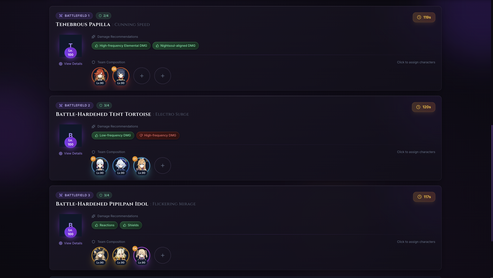

# ⚔️ Stygian Onslaught Planner

A beautiful, Genshin Impact-themed team planner for the Stygian Onslaught game mode. Import your characters from Enka Network and strategically plan your team compositions for each battlefield.



## ✨ Features

- 🔗 **Enka Network Integration**: Import your characters directly from your Genshin Impact UID
- 🎮 **Team Planning**: Assign characters to each of the 10 battlefields
- 📊 **Boss Information**: View detailed boss mechanics, recommended damage types, and strategy tips
- ➕ **Manual Character Addition**: Add characters manually when they're not in your Enka profile
- 📝 **Character Management**: Edit character levels and constellations, refresh data from Enka
- 🧪 **Element & Weapon Filtering**: Filter characters by element and weapon type when adding
- 💾 **Persistent Storage**: Your team compositions are saved locally
- 🎨 **Genshin-Inspired UI**: Dark fantasy aesthetic with element-colored accents
- 📱 **Responsive Design**: Works seamlessly on desktop and mobile devices
- ⚡ **Real-time Updates**: Characters update instantly when assigned or removed

## 🚀 Getting Started

### Prerequisites

- Node.js 18+ 
- npm or yarn

### Installation

1. Clone the repository:
```bash
git clone https://github.com/yourusername/stygian-onslaught-planner.git
cd stygian-onslaught-planner
```

2. Install dependencies:
```bash
npm install
```

3. Start the development server:
```bash
npm run dev
```

4. Open your browser and navigate to `http://localhost:5173`

## 📖 Usage Guide

### Importing Your Characters

1. Enter your Genshin Impact UID in the "Import Characters" section
2. Click "Fetch" to load your characters from Enka Network
3. Your characters will be displayed with their element colors and levels

> **Note:** Make sure your Enka Network profile is set to public for the import to work.

### Planning Your Teams

1. Click on any empty team slot (the circular "+" buttons)
2. Select a character from your imported roster
3. The character will be assigned to that battlefield
4. Click the "×" button on a character to remove them from the slot
5. Click on the boss avatar to view detailed boss information

## 🛠️ Tech Stack

- **Framework**: React 18 with TypeScript
- **Build Tool**: Vite
- **Styling**: Tailwind CSS
- **UI Components**: shadcn/ui
- **State Management**: Zustand
- **Data Source**: Enka Network API
- **Icons**: Lucide React

## 📁 Project Structure

```
src/
├── components/
│   ├── battlefield/      # Battlefield-related components
│   │   ├── BattlefieldCard.tsx
│   │   ├── BattlefieldList.tsx
│   │   └── BossInfoModal.tsx
│   ├── character/        # Character-related components
│   │   ├── CharacterSelectorModal.tsx
│   │   └── TeamSlot.tsx
│   ├── ui/               # shadcn/ui components
│   └── uid/              # UID input section
│       └── UIDInputSection.tsx
├── data/                 # Static data (bosses, characters)
├── hooks/                # Custom React hooks
├── services/             # API services
├── store/                # Zustand state management
├── types/                # TypeScript type definitions
├── App.tsx
├── index.css
└── main.tsx
```

## 🔧 Configuration

### Environment Variables

Create a `.env` file in the root directory:

```env
# Optional: Custom Enka Network API endpoint
VITE_ENKA_API_URL=https://enka.network/api/uid
```

### Customizing Boss Data

Boss information is stored in `src/data/bosses.ts`. You can modify this file to:
- Update boss stats
- Add new mechanics
- Change recommended damage types
- Update strategy tips

## 🤝 Contributing

Contributions are welcome! Please feel free to submit a Pull Request.

1. Fork the repository
2. Create your feature branch (`git checkout -b feature/AmazingFeature`)
3. Commit your changes (`git commit -m 'Add some AmazingFeature'`)
4. Push to the branch (`git push origin feature/AmazingFeature`)
5. Open a Pull Request

## 📝 License

This project is licensed under the MIT License - see the [LICENSE](LICENSE) file for details.

## 🙏 Acknowledgments

- **HoYoverse** for creating Genshin Impact
- **Enka Network** for providing the character data API
- **shadcn/ui** for the beautiful UI components
- The Genshin Impact community for inspiration and support

## ⚠️ Disclaimer

Stygian Onslaught Planner is not affiliated with HoYoverse. Genshin Impact and all related assets are trademarks of HoYoverse.

Character data is fetched from Enka Network. Please ensure your Enka profile is public to use the import feature.

---

<div align="center">

Made with ❤️ for Genshin Impact players

</div>
