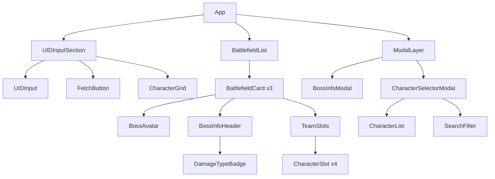
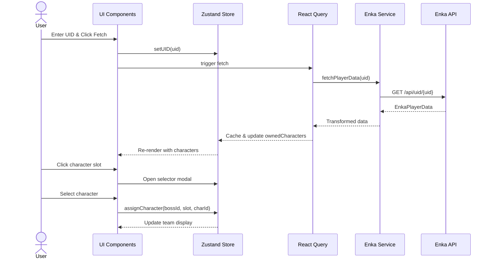

# Stygian Onslaught Planner - Technical Architecture

## Overview

A React-based web application for planning Genshin Impact's Stygian Onslaught event teams. The app allows players to view boss encounters, customize team compositions, and import their character roster via Enka Network API.

---

## 1. Technology Stack

### Core Framework
| Technology | Purpose | Rationale |
|------------|---------|-----------|
| **React 18+** | UI Framework | Component-based architecture, concurrent features |
| **TypeScript** | Type Safety | Compile-time error checking, better DX |
| **Vite** | Build Tool | Fast HMR, optimized production builds |

### State Management
| Technology | Purpose | Rationale |
|------------|---------|-----------|
| **Zustand** | Global State | Lightweight, minimal boilerplate, TypeScript-friendly |
| **React Query (TanStack Query)** | Server State | Caching, background refetching, optimistic updates for Enka API |

### Styling
| Technology | Purpose | Rationale |
|------------|---------|-----------|
| **Tailwind CSS** | Utility-first CSS | Rapid development, consistent design system |
| **shadcn/ui** | Component Library | Accessible, customizable components |
| **Lucide React** | Icons | Consistent iconography |

### Data Fetching
| Technology | Purpose | Rationale |
|------------|---------|-----------|
| **Axios** | HTTP Client | Request/response interceptors, error handling |

---

## 2. Component Structure

```
┌─────────────────────────────────────────────────────────────────┐
│                         App                                     │
├─────────────────────────────────────────────────────────────────┤
│  ┌─────────────────────────────────────────────────────────┐   │
│  │                    UIDInputSection                       │   │
│  │  ┌─────────────┐  ┌─────────────┐  ┌─────────────────┐  │   │
│  │  │  UIDInput   │  │FetchButton  │  │ CharacterGrid   │  │   │
│  │  └─────────────┘  └─────────────┘  └─────────────────┘  │   │
│  └─────────────────────────────────────────────────────────┘   │
├─────────────────────────────────────────────────────────────────┤
│  ┌─────────────────────────────────────────────────────────┐   │
│  │                   BattlefieldList                        │   │
│  │  ┌─────────────────────────────────────────────────┐    │   │
│  │  │              BattlefieldCard                     │    │   │
│  │  │  ┌───────────┐  ┌────────────────────────────┐  │    │   │
│  │  │  │BossAvatar │  │     BossInfoHeader         │  │    │   │
│  │  │  │  + Level  │  │  - Name, Subtitle          │  │    │   │
│  │  │  │  + Click  │  │  - BattleTime              │  │    │   │
│  │  │  │  handler  │  │  - DamageTypeBadges        │  │    │   │
│  │  │  └───────────┘  └────────────────────────────┘  │    │   │
│  │  │  ┌────────────────────────────────────────────┐  │    │   │
│  │  │  │           TeamSlots                         │  │    │   │
│  │  │  │  [Slot1] [Slot2] [Slot3] [Slot4]           │  │    │   │
│  │  │  │   +Click to open CharacterSelector         │  │    │   │
│  │  │  └────────────────────────────────────────────┘  │    │   │
│  │  └─────────────────────────────────────────────────┘    │   │
│  │  (x3 for 3 battlefields)                                │   │
│  └─────────────────────────────────────────────────────────┘   │
├─────────────────────────────────────────────────────────────────┤
│                    Modal/Dialog Layer                           │
│  ┌─────────────────┐  ┌─────────────────────────────────────┐  │
│  │  BossInfoModal  │  │      CharacterSelectorModal          │  │
│  │  - Boss details │  │  - Searchable character list         │  │
│  │  - Mechanics    │  │  - Filters by element/weapon         │  │
│  │  - Tips         │  │  - Shows owned vs not-owned          │  │
│  └─────────────────┘  └─────────────────────────────────────┘  │
└─────────────────────────────────────────────────────────────────┘
```

### Component Hierarchy



---

## 3. Data Models

### Boss Entity
```typescript
interface Boss {
  id: string;                    // Unique identifier
  name: string;                  // Display name
  subtitle: string;              // Secondary description
  level: number;                 // Boss level (e.g., 100)
  iconUrl: string;               // Boss avatar image URL
  battleTime: number;            // Time limit in seconds
  recommendedDamageTypes: DamageType[];
  discouragedDamageTypes: DamageType[];
  mechanics: BossMechanic[];     // Detailed info for modal
  tips: string[];                // Strategy tips
}

interface DamageType {
  type: 'elemental' | 'physical' | 'reaction' | 'special';
  label: string;                 // Display text
  icon?: string;                 // Optional icon identifier
}

interface BossMechanic {
  title: string;
  description: string;
  iconUrl?: string;
}
```

### Character Entity
```typescript
interface Character {
  id: string;                    // Character ID (e.g., "alhaitham")
  name: string;                  // Display name
  element: ElementType;          // Pyro, Hydro, Electro, etc.
  weaponType: WeaponType;        // Sword, Claymore, etc.
  iconUrl: string;               // Character portrait
  rarity: 4 | 5;                 // 4-star or 5-star
}

interface OwnedCharacter extends Character {
  level: number;
  constellation: number;         // 0-6
  talents: {
    normalAttack: number;
    elementalSkill: number;
    elementalBurst: number;
  };
}

type ElementType = 'pyro' | 'hydro' | 'electro' | 'cryo' | 'dendro' | 'anemo' | 'geo';
type WeaponType = 'sword' | 'claymore' | 'polearm' | 'catalyst' | 'bow';
```

### Team Composition
```typescript
interface TeamSlot {
  position: 0 | 1 | 2 | 3;       // 4 slots (0-indexed)
  characterId: string | null;    // null if empty
}

interface BattlefieldTeam {
  battlefieldId: string;
  slots: TeamSlot[];
}

interface TeamComposition {
  uid: string;
  battlefields: BattlefieldTeam[];
  lastUpdated: Date;
}
```

### Enka Network API Response
```typescript
// Enka Network API: https://enka.network/api/uid/{uid}
interface EnkaPlayerData {
  player: {
    nickname: string;
    level: number;
    signature?: string;
    worldLevel?: number;
    nameCardId?: number;
    finishAchievementNum?: number;
    towerFloorIndex?: number;
    towerLevelIndex?: number;
    showAvatarInfoList?: Array<{
      avatarId: number;
      level: number;
    }>;
    showNameCardIdList?: number[];
    profilePicture?: {
      avatarId: number;
    };
  };
  avatarInfoList: EnkaCharacterData[];
  ttl: number;                   // Cache time-to-live
  uid: string;
}

interface EnkaCharacterData {
  avatarId: number;              // Character ID
  propMap: {
    [key: string]: {
      type: number;
      ival: string;
      val?: string;
    };
  };
  fightPropMap: {
    [key: string]: number;       // Combat stats
  };
  skillDepotId: number;          // Skill set ID
  inherentProudSkillList: number[];  // Passive talents
  skillLevelMap: {
    [skillId: string]: number;   // Talent levels
  };
  equipList: EnkaEquipment[];    // Weapon & artifacts
  fetterInfo?: {
    expLevel: number;            // Friendship level
  };
  talentIdList?: number[];       // Constellation IDs
  proudSkillExtraLevelMap?: {
    [skillId: string]: number;
  };
}

interface EnkaEquipment {
  itemId: number;
  reliquary?: EnkaReliquary;     // If artifact
  weapon?: EnkaWeapon;           // If weapon
  flat: {
    itemType: string;
    nameTextMapHash: string;
    rankLevel: number;
    // ... other properties
  };
}
```

---

## 4. API Integration Strategy

### Enka Network Integration

#### API Endpoint
```
GET https://enka.network/api/uid/{uid}
```

#### Rate Limiting & Caching
- **Rate Limit**: Enka Network has rate limits (typically 5-10 requests per minute)
- **TTL**: Response includes `ttl` field indicating cache duration
- **Strategy**: Use React Query with `staleTime` matching API's TTL

#### Data Transformation Pipeline
```
┌─────────────────┐    ┌──────────────────┐    ┌─────────────────┐
│  Enka API       │───▶│  Transformer     │───▶│  App State      │
│  Response       │    │  Service         │    │  (Zustand)      │
└─────────────────┘    └──────────────────┘    └─────────────────┘
                              │
                              ▼
                    ┌──────────────────┐
                    │  Character       │
                    │  Mapping         │
                    │  (avatarId →     │
                    │   characterId)   │
                    └──────────────────┘
```

#### Character ID Mapping
Enka Network uses numeric `avatarId` values that need mapping to character identifiers:

```typescript
// Example mapping (simplified)
const AVATAR_ID_MAP: Record<number, string> = {
  10000002: 'kamisato-ayaka',
  10000003: 'jean',
  10000005: 'traveler-anemo',
  10000006: 'lisa',
  10000007: 'traveler-geo',
  // ... etc
};
```

#### API Service Structure
```typescript
// services/enkaApi.ts
class EnkaApiService {
  async fetchPlayerData(uid: string): Promise<EnkaPlayerData>;
  
  // Transform Enka data to app format
  transformToOwnedCharacters(
    avatarInfoList: EnkaCharacterData[]
  ): OwnedCharacter[];
  
  // Extract character level from propMap
  extractCharacterLevel(propMap: EnkaCharacterData['propMap']): number;
  
  // Extract constellation count
  extractConstellation(talentIdList?: number[]): number;
  
  // Extract talent levels
  extractTalentLevels(skillLevelMap: EnkaCharacterData['skillLevelMap']): {
    normalAttack: number;
    elementalSkill: number;
    elementalBurst: number;
  };
}
```

---

## 5. File/Folder Structure

```
stygian-planner/
├── public/
│   ├── bosses/                    # Boss icon assets
│   │   ├── tenebrous-papilla.png
│   │   ├── tent-tortoise.png
│   │   └── pipilan-idol.png
│   └── characters/                # Character icon assets (or CDN)
├── src/
│   ├── components/
│   │   ├── ui/                    # shadcn/ui components
│   │   │   ├── button.tsx
│   │   │   ├── dialog.tsx
│   │   │   ├── input.tsx
│   │   │   └── badge.tsx
│   │   ├── battlefield/
│   │   │   ├── BattlefieldList.tsx
│   │   │   ├── BattlefieldCard.tsx
│   │   │   ├── BossAvatar.tsx
│   │   │   ├── BossInfoHeader.tsx
│   │   │   ├── TeamSlots.tsx
│   │   │   └── CharacterSlot.tsx
│   │   ├── character/
│   │   │   ├── CharacterGrid.tsx
│   │   │   ├── CharacterCard.tsx
│   │   │   └── CharacterSelectorModal.tsx
│   │   └── uid/
│   │       ├── UIDInputSection.tsx
│   │       └── UIDInput.tsx
│   ├── hooks/
│   │   ├── useEnkaQuery.ts        # React Query hook for Enka API
│   │   ├── useTeamStore.ts        # Zustand store for teams
│   │   └── useBossData.ts         # Static boss data hook
│   ├── services/
│   │   ├── enkaApi.ts             # Enka API service
│   │   └── characterMapper.ts     # avatarId → character mapping
│   ├── types/
│   │   ├── boss.ts
│   │   ├── character.ts
│   │   ├── team.ts
│   │   └── enka.ts
│   ├── data/
│   │   ├── bosses.ts              # Static boss data
│   │   └── characters.ts          # Static character metadata
│   ├── lib/
│   │   └── utils.ts               # Utility functions
│   ├── App.tsx
│   └── main.tsx
├── docs/
│   └── architecture.md            # This document
├── tailwind.config.ts
├── tsconfig.json
└── package.json
```

---

## 6. Key Implementation Considerations

### State Management Strategy

#### Zustand Store Design
```typescript
// stores/teamStore.ts
interface TeamState {
  // State
  currentUID: string | null;
  ownedCharacters: OwnedCharacter[];
  teams: Record<string, BattlefieldTeam>; // keyed by battlefieldId
  
  // Actions
  setUID: (uid: string) => void;
  setOwnedCharacters: (characters: OwnedCharacter[]) => void;
  assignCharacter: (
    battlefieldId: string,
    slotPosition: number,
    characterId: string
  ) => void;
  removeCharacter: (
    battlefieldId: string,
    slotPosition: number
  ) => void;
  clearAllTeams: () => void;
}
```

### Performance Optimizations

1. **React Query Caching**: Cache Enka API responses with TTL-aware `staleTime`
2. **Memoization**: Use `React.memo` for character cards and boss cards
3. **Virtualization**: Consider virtual scrolling if character list grows large
4. **Image Optimization**: Use WebP format with fallbacks, lazy loading

### Error Handling

| Scenario | Strategy |
|----------|----------|
| Invalid UID | Display user-friendly error, clear previous data |
| Private profile | Inform user to enable "Show Character Details" in-game |
| Rate limiting | Show countdown timer, implement retry logic |
| Network failure | Retry with exponential backoff |
| Character not found in mapping | Log warning, skip character gracefully |

### Accessibility

- All interactive elements keyboard accessible
- ARIA labels for boss avatars and character slots
- Focus trap in modals
- Color contrast compliant with WCAG 2.1 AA
- Screen reader support for damage type indicators

### Responsive Design

| Breakpoint | Layout |
|------------|--------|
| Mobile (<640px) | Single column, stacked battlefield cards |
| Tablet (640-1024px) | Single column, wider cards |
| Desktop (>1024px) | Full layout as shown in screenshot |

### Security Considerations

- No sensitive data stored (UID is public information)
- LocalStorage for team persistence (optional)
- No server-side storage needed
- CORS handled by Enka Network API

### Future Extensibility

- **Team Sharing**: Export/import team compositions as JSON/codes
- **Damage Calculator**: Integrate with damage calculation formulas
- **Build Recommendations**: Suggest artifacts/weapons per character
- **Multiple Accounts**: Support for multiple UID profiles
- **History**: Track team performance over time

---

## 7. UI Component Specifications

### BattlefieldCard

**Props:**
```typescript
interface BattlefieldCardProps {
  boss: Boss;
  team: TeamSlot[];
  onBossClick: (bossId: string) => void;
  onSlotClick: (slotPosition: number) => void;
}
```

**Visual Structure:**
- Left column: Boss avatar (clickable) with level badge
- Right column: 
  - Header: Name, subtitle, battle time
  - Damage type badges (green/red)
  - 4 character slots in a row

### CharacterSelectorModal

**Props:**
```typescript
interface CharacterSelectorModalProps {
  isOpen: boolean;
  onClose: () => void;
  onSelect: (characterId: string) => void;
  ownedCharacters: OwnedCharacter[];
  selectedCharacterId: string | null;
}
```

**Features:**
- Search by name
- Filter by element
- Filter by weapon type
- Sort by level/constellation
- Visual distinction for owned vs not-owned

---

## 8. Data Flow Diagram



---

## Appendix: Enka Network Resources

- **API Documentation**: https://enka.network/
- **Character Assets**: https://enka.network/ui/
- **Data Mapping**: https://github.com/EnkaNetwork/API-docs

---

*Document Version: 1.0*
*Last Updated: 2026-02-01*
